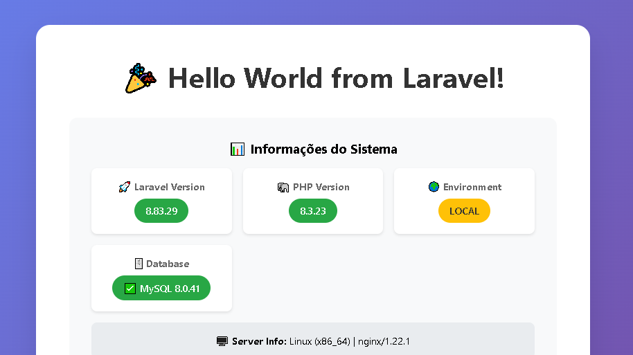

<!-- 
  Tags: DevOps
  Label: ⚙️ GCP/Heroku Docker - GitHub Actions.
  Description: Aplicação Flask Dockerizada com CI/CD Automatizado
  path_hook: hookfigma.hook18
-->

# 🚀 Projeto Laravel Dockerizado com CI/CD - Google Cloud Run

<div align="center">  
  
  
  
  
  
  
   
</div>

## 📖 Sobre o Projeto

Este projeto implementa uma aplicação web completa em **Laravel 8.x** com arquitetura dockerizada e pipeline de CI/CD totalmente automatizado usando **GitHub Actions** para deploy no **Google Cloud Run**.

### ✨ Características:

- **🎨 Interface Moderna** com design responsivo e animações elegantes
- **🐳 Containerização Completa** com Docker multi-service
- **🚀 Deploy Automatizado** via GitHub Actions para Google Cloud Run
- **🗄️ MySQL 8.0** com phpMyAdmin para administração
- **⚡ PHP 8.3** com extensões otimizadas
- **🔧 Nginx** como proxy reverso com configurações de segurança
- **📊 Supervisor** para gerenciamento de processos
- **🔄 Migrações Automáticas** no pipeline de deploy
- **🧪 Testes Automatizados** no CI/CD

---

## 🎯 Demonstração

A aplicação exibe:

- ✅ **Dashboard de Sistema** com informações detalhadas do ambiente
- 🕐 **Status em Tempo Real** da aplicação e banco de dados
- 📱 **Interface Responsiva** para todos os dispositivos
- 🎨 **Design Moderno** com efeitos glassmorphism
- 🔍 **Endpoints de API** para monitoramento e integração
- 🗄️ **phpMyAdmin** integrado para administração do banco

---

## 📁 Estrutura do Projeto

```
laravel-docker-app/
├── 📂 app/
│   └── Http/Controllers/
│       └── HelloController.php         # 🎯 Controller principal
├── 📂 docker/
│   ├── nginx/
│   │   └── default.conf               # ⚙️ Configuração Nginx
│   ├── php/
│   │   └── local.ini                  # 🐘 Configurações PHP
│   ├── mysql/
│   │   └── my.cnf                     # 🗄️ Configurações MySQL
│   └── supervisor/
│       └── supervisord.conf           # 📊 Supervisor config
├── 📂 resources/views/
│   └── hello.blade.php                # 🎨 Template principal
├── 📂 .github/workflows/
│   └── deploy.yml                     # ⚙️ Pipeline CI/CD
├── 🐳 Dockerfile                      # 📦 Imagem Docker
├── 🐳 docker-compose.yml             # 🛠️ Orquestração local
├── 🚀 start.sh                       # 🎬 Script de inicialização
├── 🔧 dev.sh                         # 🛠️ Ferramentas de desenvolvimento
├── 📝 .env                           # 🔐 Variáveis de ambiente
├── 📝 .gitignore                     # 🚫 Arquivos ignorados
└── 📖 README.md                      # 📚 Documentação
```

---

## 🔧 Pré-requisitos

### Para Google Cloud Platform (GCP)
- ☁️ **Conta Google Cloud** ativa com billing habilitado
- 🔧 **Projeto GCP** criado (anote o `PROJECT_ID`)
- 🗄️ **Cloud SQL** com instância MySQL configurada

### Para desenvolvimento local
- 💻 **Docker Desktop** instalado
- 🐙 **Git** configurado
- 🔑 **Repositório GitHub** criado

---

# 🌐 CONFIGURAÇÃO GOOGLE CLOUD RUN

## 📋 Como Obter Variáveis do Google Cloud Platform

### 🔍 **Localizando Informações Essenciais do GCP**

#### **1️⃣ PROJECT_ID - ID do Projeto**

**Método 1: Console Web**
1. Acesse [Google Cloud Console](https://console.cloud.google.com)
2. No topo da página, clique no **seletor de projeto**
3. Na janela que abrir, você verá:
   - **Nome do Projeto**: Ex: "Laravel App"
   - **ID do Projeto**: Ex: `laravel-app-123456` ✅ **Esta é a variável!**

**Método 2: Cloud Shell/Terminal**
```bash
# Listar todos os projetos
gcloud projects list

# Ver projeto atual
gcloud config get-value project

# Definir projeto (se necessário)
gcloud config set project SEU_PROJECT_ID
```

#### **2️⃣ REGION - Região do Google Cloud**

**Regiões recomendadas:**
```bash
# São Paulo (recomendada para Brasil)
southamerica-east1

# Outras opções próximas
us-east1        # Virgínia do Norte (boa latência)
us-central1     # Iowa (padrão em muitos tutoriais)
```

#### **3️⃣ SERVICE_ACCOUNT_EMAIL - Email da Conta de Serviço**

**Após criar a Service Account:**
```bash
# Listar todas as service accounts
gcloud iam service-accounts list

# Formato padrão será:
# github-actions-sa@SEU_PROJECT_ID.iam.gserviceaccount.com
```

#### **4️⃣ CLOUD_SQL_INSTANCE - Instância Cloud SQL**

**Formato padrão:**
```
PROJECT_ID:REGION:INSTANCE_NAME
```

**Exemplo real:**
```
laravel-app-123:us-central1:laravel-db-prod
```

## 📊 **Script para Coleta de Variáveis GCP**

Cole este script no **Google Cloud Shell** para obter todas as informações:

```bash
#!/bin/bash

echo "🔍 COLETANDO INFORMAÇÕES DO GCP..."
echo "=================================="

# Obter PROJECT_ID atual
PROJECT_ID=$(gcloud config get-value project)
echo "📌 PROJECT_ID: $PROJECT_ID"

# Obter região padrão (se configurada)
REGION=$(gcloud config get-value compute/region 2>/dev/null)
if [ -z "$REGION" ]; then
    REGION="us-central1"  # Padrão
fi
echo "🌍 REGION: $REGION"

# Definir nomes padrão
SERVICE_ACCOUNT_NAME="github-actions-sa"
REPOSITORY_NAME="laravel-app"
SERVICE_NAME="laravel-docker-app"
SQL_INSTANCE_PROD="laravel-db-prod"
SQL_INSTANCE_STAGING="laravel-db-staging"

echo "👤 SERVICE_ACCOUNT_EMAIL: $SERVICE_ACCOUNT_NAME@$PROJECT_ID.iam.gserviceaccount.com"
echo "📦 ARTIFACT_REGISTRY_URL: $REGION-docker.pkg.dev/$PROJECT_ID/$REPOSITORY_NAME"
echo "🐳 REPOSITORY_NAME: $REPOSITORY_NAME"
echo "🚀 SERVICE_NAME: $SERVICE_NAME"
echo "🗄️ CLOUD_SQL_PROD: $PROJECT_ID:$REGION:$SQL_INSTANCE_PROD"
echo "🧪 CLOUD_SQL_STAGING: $PROJECT_ID:$REGION:$SQL_INSTANCE_STAGING"

echo ""
echo "=================================="
echo "✅ INFORMAÇÕES COLETADAS COM SUCESSO!"
echo ""
echo "📝 PRÓXIMOS PASSOS:"
echo "1. Use PROJECT_ID como GitHub Secret: GCP_PROJECT_ID"
echo "2. Configure as instâncias Cloud SQL"
echo "3. Atualize as variáveis no arquivo .github/workflows/deploy.yml"
echo "=================================="
```

### 📊 **Configuração Manual Google Cloud Shell**
```bash
# 🌱 Definir variáveis (SUBSTITUA SEU_PROJECT_ID)
export PROJECT_ID="SEU_PROJECT_ID_AQUI"
export SERVICE_ACCOUNT_NAME="github-actions-sa"
export REGION="us-central1"
export REPOSITORY_NAME="laravel-app"
echo "Projeto atual: $(gcloud config get-value project)"
```

---

## ⚡ Configuração Rápida GCP

### 1️⃣ **Configurar GCP (Cloud Shell)**

```bash
# 🔧 Listar projetos disponíveis e identificar projeto ativo
gcloud projects list
gcloud config get-value project

# ✅ Configurar projeto
gcloud config set project $PROJECT_ID

# 🔧 Verificar APIs habilitadas
gcloud services list \
  --enabled \
  --filter="name:(run.googleapis.com OR artifactregistry.googleapis.com OR sqladmin.googleapis.com)" \
  --format="value(name)"

# ✅ Habilitar APIs necessárias
gcloud services enable run.googleapis.com \
  artifactregistry.googleapis.com \
  iam.googleapis.com \
  cloudbuild.googleapis.com \
  sqladmin.googleapis.com

# 🔧 Verificar Repositório Artifact Registry existe
gcloud artifacts repositories list --format="table(name,location)"

# ✅ Criar repositório Artifact Registry
gcloud artifacts repositories create $REPOSITORY_NAME \
  --repository-format=docker \
  --location=$REGION \
  --description="Repositório Docker para Laravel App"

# 🔧 Verificar Service Account existe
gcloud iam service-accounts list --filter="email:github-actions-sa@*"

# ✅ Criar Service Account
gcloud iam service-accounts create $SERVICE_ACCOUNT_NAME \
  --display-name="Service Account para GitHub Actions Laravel"

# 🔧 Verificar Permissões da Service Account
gcloud projects get-iam-policy $(gcloud config get-value project) \
  --flatten="bindings[].members" \
  --filter="bindings.members:serviceAccount:github-actions-sa@*" \
  --format="table(bindings.role)"

# ✅ Conceder permissões
gcloud projects add-iam-policy-binding $PROJECT_ID \
  --member="serviceAccount:$SERVICE_ACCOUNT_NAME@$PROJECT_ID.iam.gserviceaccount.com" \
  --role="roles/run.admin"

gcloud projects add-iam-policy-binding $PROJECT_ID \
  --member="serviceAccount:$SERVICE_ACCOUNT_NAME@$PROJECT_ID.iam.gserviceaccount.com" \
  --role="roles/artifactregistry.writer"

gcloud projects add-iam-policy-binding $PROJECT_ID \
  --member="serviceAccount:$SERVICE_ACCOUNT_NAME@$PROJECT_ID.iam.gserviceaccount.com" \
  --role="roles/iam.serviceAccountUser"

gcloud projects add-iam-policy-binding $PROJECT_ID \
  --member="serviceAccount:$SERVICE_ACCOUNT_NAME@$PROJECT_ID.iam.gserviceaccount.com" \
  --role="roles/cloudsql.client"

# ✅ Gerar chave da Service Account
gcloud iam service-accounts keys create sa-key.json \
  --iam-account="$SERVICE_ACCOUNT_NAME@$PROJECT_ID.iam.gserviceaccount.com"

# ✅ Exibir conteúdo para copiar
echo "=== COPIE TODO O CONTEÚDO ABAIXO ==="
cat sa-key.json
```

### 2️⃣ **Configurar Cloud SQL**

```bash
# ✅ Criar instância Cloud SQL para Produção
gcloud sql instances create laravel-db-prod \
  --database-version=MYSQL_8_0 \
  --tier=db-f1-micro \
  --region=$REGION \
  --storage-type=SSD \
  --storage-size=10GB \
  --backup-start-time=03:00 \
  --enable-bin-log \
  --maintenance-window-day=SUN \
  --maintenance-window-hour=4

# ✅ Criar instância Cloud SQL para Staging
gcloud sql instances create laravel-db-staging \
  --database-version=MYSQL_8_0 \
  --tier=db-f1-micro \
  --region=$REGION \
  --storage-type=SSD \
  --storage-size=10GB

# ✅ Criar banco de dados
gcloud sql databases create laravel_prod --instance=laravel-db-prod
gcloud sql databases create laravel_staging --instance=laravel-db-staging

# ✅ Criar usuários
gcloud sql users create laravel_user \
  --instance=laravel-db-prod \
  --password=SENHA_SEGURA_PROD

gcloud sql users create laravel_user \
  --instance=laravel-db-staging \
  --password=SENHA_SEGURA_STAGING
```

### 3️⃣ **Configurar GitHub Secrets**

No seu repositório GitHub:

1. **Settings** → **Secrets and variables** → **Actions**
2. **New repository secret** e crie:

```bash
# 🔑 Secrets obrigatórios:
GCP_SA_KEY               # JSON completo da Service Account
GCP_PROJECT_ID           # ID do seu projeto GCP
GCP_SA_EMAIL            # Email da Service Account
LARAVEL_APP_KEY         # Chave do Laravel (php artisan key:generate --show)

# 🗄️ Secrets do banco PRODUÇÃO:
DB_DATABASE             # laravel_prod
DB_USERNAME             # laravel_user
DB_PASSWORD             # SENHA_SEGURA_PROD

# 🧪 Secrets do banco STAGING:
DB_DATABASE_STAGING     # laravel_staging
DB_USERNAME_STAGING     # laravel_user
DB_PASSWORD_STAGING     # SENHA_SEGURA_STAGING
```

---

## 🚀 Deploy Automático

### Para iniciar o projeto:
```bash
# Clone e configure
git clone <URL_DO_SEU_REPOSITORIO>
cd laravel-docker-app

# Executar setup automatizado
chmod +x start.sh
./start.sh

# Para desenvolvimento
chmod +x dev.sh
./dev.sh logs  # Ver logs em tempo real
```

### Para deploy no Google Cloud Run:
```bash
# Adicione os arquivos do projeto
git add .
git commit -m "🚀 Initial deploy to GCP Cloud Run"

# Push para branch main (produção)
git push origin main

# Push para branch develop (staging)
git checkout -b develop
git push origin develop
```

🎉 **Pronto!** Os GitHub Actions serão executados automaticamente.

---

## 🔄 Workflows e Ambientes

### 🌐 **Ambientes de Deploy**
- **🚀 Produção**: Branch `main` → Deploy automático para Cloud Run
- **🧪 Staging**: Branch `develop` → Deploy automático para ambiente de testes
- **✅ Testes**: Executados em todas as branches antes do deploy

### 📊 **Pipeline CI/CD**
1. **🧪 Testes Automatizados** - PHPUnit com MySQL
2. **🐳 Build da Imagem Docker** - Otimizada para produção
3. **📦 Push para Artifact Registry** - Versionamento por commit SHA
4. **🚀 Deploy no Cloud Run** - Com configurações específicas do ambiente
5. **🗄️ Migrações Automáticas** - Executadas via Cloud Run Jobs
6. **📊 Verificação de Saúde** - Health checks pós-deploy

---

## 🖥️ Desenvolvimento Local

### Executar com Docker Compose:
```bash
# Iniciar todos os serviços
./start.sh

# Comandos úteis de desenvolvimento
./dev.sh bash          # Acessar container
./dev.sh artisan make:controller ExampleController
./dev.sh composer install
./dev.sh migrate
./dev.sh test
./dev.sh fresh         # Reset database
```

### Acessos locais:
- 🌐 **Aplicação**: `http://localhost:8000`
- 🗄️ **phpMyAdmin**: `http://localhost:8080`
- 📡 **API Health**: `http://localhost:8000/api/hello`
- ℹ️ **System Info**: `http://localhost:8000/info`

---

## 📋 Variáveis de Configuração

### 🌐 **GitHub Secrets Necessários**
| Variável | Descrição | Exemplo |
|----------|-----------|---------|
| `GCP_SA_KEY` | JSON da Service Account | `{json completo}` |
| `GCP_PROJECT_ID` | ID do projeto GCP | `laravel-app-123456` |
| `GCP_SA_EMAIL` | Email da Service Account | `github-actions-sa@projeto.iam.gserviceaccount.com` |
| `LARAVEL_APP_KEY` | Chave do Laravel | `base64:abc123...` |
| `DB_DATABASE` | Nome do banco (prod) | `laravel_prod` |
| `DB_USERNAME` | Usuário do banco (prod) | `laravel_user` |
| `DB_PASSWORD` | Senha do banco (prod) | `senha_segura` |
| `DB_DATABASE_STAGING` | Nome do banco (staging) | `laravel_staging` |
| `DB_USERNAME_STAGING` | Usuário do banco (staging) | `laravel_user` |
| `DB_PASSWORD_STAGING` | Senha do banco (staging) | `senha_staging` |

### ⚙️ **Workflow Variables**
Edite `.github/workflows/deploy.yml` e ajuste:
```yaml
env:
  PROJECT_ID: ${{ secrets.GCP_PROJECT_ID }}
  GAR_LOCATION: us-central1
  REPOSITORY: laravel-app
  SERVICE: laravel-docker-app
  REGION: us-central1
```

---

## 🔧 Recursos e Funcionalidades

### 🎨 **Interface da Aplicação**
- ✅ Dashboard responsivo com informações do sistema
- 📊 Status em tempo real do banco de dados
- 🖥️ Informações detalhadas do servidor
- 📱 Design mobile-first
- 🎭 Animações e efeitos visuais modernos

### 🐳 **Containerização**
- **PHP 8.3-FPM** com extensões otimizadas
- **Nginx** como servidor web e proxy reverso
- **MySQL 8.0** com configurações de performance
- **phpMyAdmin** para administração visual
- **Supervisor** para gerenciamento de processos

### 🚀 **Produção**
- **Otimização de Performance** - OPcache, cache de configurações
- **Configurações de Segurança** - Headers HTTP, permissões
- **Monitoramento** - Health checks e logs estruturados
- **Escalabilidade** - Auto-scaling no Cloud Run
- **Backup Automático** - Cloud SQL com backups diários

---

## 🔍 Monitoramento e Logs

### 📊 **Verificação dos Deploys**
```bash
# Via Google Cloud CLI
gcloud run services list --region=us-central1

# Logs da aplicação
gcloud logs read --limit=50 --format="table(textPayload)" \
  --filter="resource.type=cloud_run_revision AND resource.labels.service_name=laravel-docker-app"

# Status do Cloud SQL
gcloud sql instances list
```

### 🔍 **Endpoints de Monitoramento**
- `/` - Dashboard principal
- `/api/hello` - Health check da API
- `/info` - Informações detalhadas do sistema
- Health check automático no Cloud Run

---

## 💰 Custos Estimados (Tier Gratuito)

### 🌐 **Google Cloud Run**
- ✅ **2 milhões** de requisições/mês
- ✅ **180.000** vCPU-segundos/mês  
- ✅ **360.000** GiB-segundos de memória/mês

### 🗄️ **Cloud SQL (MySQL)**
- 💵 **db-f1-micro**: ~$7/mês
- 📦 **10GB SSD**: ~$1.70/mês
- 🔄 **Backup**: Incluído no preço

### 📦 **Artifact Registry**
- ✅ **0.5 GB** gratuito/mês
- 💵 **$0.10/GB** acima do limite

**🎁 Novos usuários**: $300 em créditos gratuitos

---

## 🔧 Resolução de Problemas

### ❌ **Erros Comuns - Google Cloud**

**"Permission Denied"**
```bash
# Verificar permissões da service account
gcloud projects get-iam-policy $PROJECT_ID \
  --filter="bindings.members:serviceAccount:github-actions-sa@$PROJECT_ID.iam.gserviceaccount.com"
```

**"Cloud SQL Connection Failed"**
```bash
# Verificar instâncias Cloud SQL
gcloud sql instances list

# Verificar conexão
gcloud sql instances describe INSTANCE_NAME
```

**"Laravel Key Not Set"**
```bash
# Gerar nova chave
php artisan key:generate --show
# Adicionar como secret LARAVEL_APP_KEY no GitHub
```

### ❌ **Problemas de Deploy**

**"Build Failed"**
- Verifique se todas as dependências do `composer.json` estão corretas
- Teste o build localmente: `docker build -t test .`

**"Migration Failed"**
- Verifique as credenciais do Cloud SQL nos secrets
- Confirme se a instância Cloud SQL está ativa

**"Service Unavailable"**
```bash
# Verificar logs do Cloud Run
gcloud logs read --limit=10 \
  --filter="resource.type=cloud_run_revision AND resource.labels.service_name=laravel-docker-app"
```

### 🔄 **Sincronização de Ambientes**
```bash
# Sincronizar staging com produção
git checkout develop
git merge main
git push origin develop

# Reverter deploy (se necessário)
gcloud run services update-traffic laravel-docker-app \
  --to-revisions=REVISION_ANTERIOR=100 \
  --region=us-central1
```

---

## 🧹 Limpeza de Recursos

### 🌐 **Google Cloud**
```bash
# Deletar serviços Cloud Run
gcloud run services delete laravel-docker-app --region=us-central1
gcloud run services delete laravel-docker-app-staging --region=us-central1

# Deletar instâncias Cloud SQL
gcloud sql instances delete laravel-db-prod
gcloud sql instances delete laravel-db-staging

# Deletar repositório Artifact Registry  
gcloud artifacts repositories delete laravel-app --location=us-central1

# Deletar service account
gcloud iam service-accounts delete github-actions-sa@$PROJECT_ID.iam.gserviceaccount.com
```

---

## 📚 Documentação e Recursos

### 🌐 **Google Cloud**
- 📖 [Cloud Run Documentation](https://cloud.google.com/run/docs)
- 🗄️ [Cloud SQL for MySQL](https://cloud.google.com/sql/mysql)
- 💬 [Google Cloud Community](https://cloud.google.com/community)

### 🎨 **Laravel**
- 📖 [Laravel Documentation](https://laravel.com/docs)
- 🎓 [Laravel Bootcamp](https://bootcamp.laravel.com/)
- 💬 [Laravel Community](https://laravel.io/forum)

### 🐳 **Docker**
- 📖 [Docker Documentation](https://docs.docker.com/)
- 🐙 [Docker Hub](https://hub.docker.com/)

---

## 🤝 Contribuições

Contribuições são bem-vindas! Para contribuir:

1. **Fork** o projeto
2. **Crie uma branch**: `git checkout -b feature/nova-funcionalidade`
3. **Commit**: `git commit -m "✨ Adiciona nova funcionalidade"`
4. **Push**: `git push origin feature/nova-funcionalidade`
5. **Abra um Pull Request**

### 🔄 **Padrões de Commit**
- ✨ `:sparkles:` - Nova funcionalidade
- 🐛 `:bug:` - Correção de bug
- 📚 `:books:` - Documentação
- 🎨 `:art:` - Melhorias de UI/UX
- ⚡ `:zap:` - Performance
- 🔧 `:wrench:` - Configuração

---

## 📄 Licença

Este projeto está sob licença MIT. Veja o arquivo [LICENSE](LICENSE) para detalhes.

---

## 🆘 Suporte

### Problemas Comuns:
- 📖 Consulte a seção "Resolução de Problemas"
- 🔍 Veja os logs no GitHub Actions
- 📊 Monitore no Google Cloud Console

### Precisa de Ajuda?
- 🐛 Abra uma [Issue](../../issues)
- 💬 Inicie uma [Discussion](../../discussions)
- 📧 Entre em contato através do GitHub

---

## 🚀 Quick Start

### Para começar rapidamente:

1. **📋 Clone o repositório**
```bash
git clone <URL_DO_REPOSITORIO>
cd laravel-docker-app
```

2. **⚙️ Configure o Google Cloud** (use o script fornecido)

3. **🔑 Configure os GitHub Secrets** (lista completa acima)

4. **🗄️ Ajuste as instâncias Cloud SQL** no arquivo `deploy.yml`

5. **🚀 Faça o primeiro deploy**:
```bash
git add .
git commit -m "🚀 Initial deploy"
git push origin main
```

6. **📊 Acompanhe o deploy** nas GitHub Actions

✨ **Tip**: Teste primeiro localmente com `./start.sh` antes do deploy em produção.

---

**🎉 Projeto criado com Laravel + Docker + GitHub Actions + Google Cloud Run + MySQL**

### 📊 **Resumo da Stack**
- 🎨 **Frontend**: Blade Templates com design moderno
- ⚙️ **Backend**: Laravel 8.x com PHP 8.3
- 🗄️ **Database**: MySQL 8.0 (Cloud SQL)
- 🐳 **Container**: Docker com Nginx + PHP-FPM
- ☁️ **Cloud**: Google Cloud Run
- 🔄 **CI/CD**: GitHub Actions
- 📊 **Monitoring**: Cloud Logging + Health Checks

---

## 👨‍💻 Autor

**[Fabiano Rocha/Fabiuniz]**
- GitHub: [@fabiuniz](https://github.com/fabiuniz)
- LinkedIn: [fabiano-rocha-de-almeida-dev](https://linkedin.com/in/fabiano-rocha-de-almeida-dev)

---

<div align="center">
  <p>⭐ Se este projeto te ajudou, considere dar uma estrela!</p>
  <p>🚀 Happy Coding!</p>
</div>

